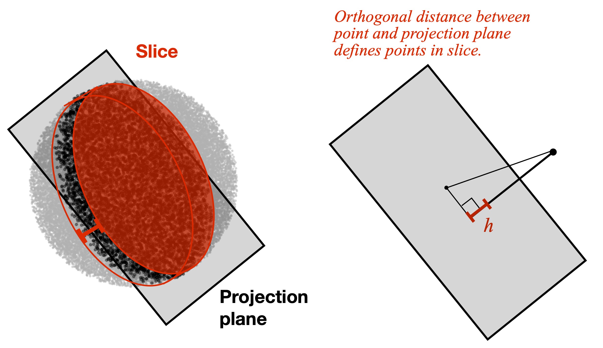
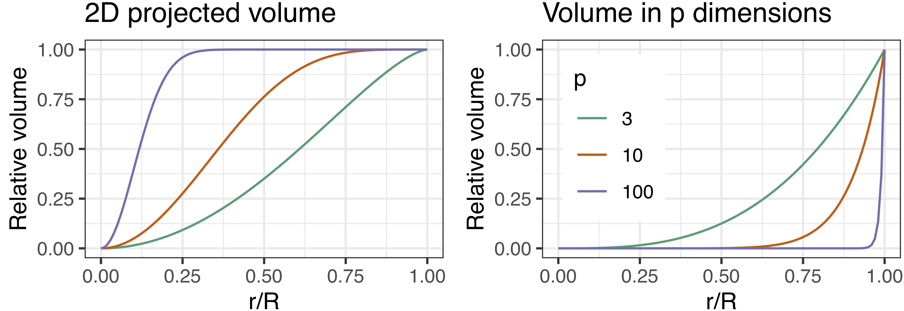
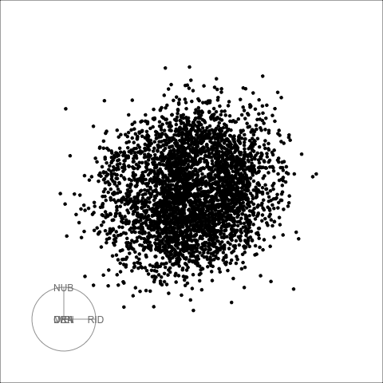

layout: false
class: split-75
background-image: url("plots/title_slide_bkg.png")
background-position: center
background-size: contain

<style type="text/css">
.remark-slide-content{
font-size: 30px;

}
code.r{
  font-size: 24px;
}

</style>

```{r setup, include=FALSE}
options(htmltools.dir.version = FALSE, width = 120)
library(tidyverse)
library(knitr)
library(kableExtra)
library(htmltools)
opts_chunk$set(
  echo = TRUE, warning = FALSE, message = FALSE, comment = "#>",
  fig.path = 'figure/', cache.path = 'cache/', fig.align = 'center',
  fig.width = 12, fig.height = 4, fig.show = 'hold',
  cache = FALSE, external = TRUE, dev = 'png', dev.args = list(bg = "transparent")
)
mp4_vid <- function(src, width){
  HTML(
    paste0(
      '<video width="', width, '" loop autoplay>
        <source src="', src, '" type="video/mp4">
      </video>'
    )
  )
}
```


```{css, echo=FALSE}
/* custom.css */
:root{
  --main-color1: #509e2f;
  --main-color2: #bcbddc;
  --main-color3: #efedf5;
  --main-color4: #9DDAE5;
  --text-color3: black;
  --text-color4: #505050;
  --code-inline-color: #4e5054;
  --link-color: #006CAB;
}
.large { font-size: 150% }
.largeish { font-size: 120% }
.summarystyle { font-size: 150%;
  line-height:150%;}
.my-gray {color: #606060!important; }
.tiny{ font-size: 25%}
```


.column[.content[

<br>

## **New displays for the visualization of multivariate data in the tourr package**

.my-gray[
.large[**Ursula Laa**]

.largeish[ Institute of Statistics <br>
University of Natural Resources and Life Sciences
]
]

useR! 2021

]]

.column[.top_abs.content[

]]

---
# Grand tour

The **grand tour** displays a sequence of smoothly **interpolated projections**, and can reveal the shape of the distribution, clusters and outliers.


```{r, echo=FALSE, warning=FALSE, message=FALSE, eval=F}
library(tidyverse)
filter <- dplyr::filter

library(tourr)
library(plotly)
library(htmltools)

set.seed(2020)
c4 <- geozoo::cube.iterate(4)
bases <- save_history(c4$points, max = 10)
tour_path <- tourr::interpolate(bases, 0.1)
d <- dim(tour_path)
pts <- NULL
edgs <- NULL
for (i in 1:d[3]) {
  d1 <- c4$points %*% matrix(tour_path[,,i], ncol=2)
  d1 <- apply(d1, 2, function(x) x-mean(x))
  pts <- rbind(pts, cbind(d1, rep(i+10, nrow(d1))))
  for (e in 1:nrow(c4$edges)){
    a <- c4$edges[e,1]
    b <- c4$edges[e,2]
    edgs <- rbind(edgs, c(d1[a,1], d1[a,2], d1[b,1], d1[b,2],i+10))
  }
}

colnames(pts) <- c("x", "y", "i")
colnames(edgs) <- c("x1", "y1", "x2", "y2", "i")

p1 <- ggplot() +
  geom_segment(data = as_tibble(edgs), aes(x=x1, xend=x2, y=y1, yend=y2, frame = i)) +
  geom_point(data = as_tibble(pts), aes(x = x, y = y, frame = i), size=1) +
  ggtitle("p=4") +
  scale_shape_manual(values=c(16, 46)) +
  coord_fixed() +
  theme_void()
pl1 <- ggplotly(p1, width=300, height=300) %>%
  animation_opts(200, redraw = FALSE, easing = "linear", transition=0) %>%
  style(hoverinfo = 'none') %>%
  config(displayModeBar = F)

pdf_data <- read_csv("pca_center.csv")
bases <- save_history(select(pdf_data, -type), max = 5)
tour_path <- tourr::interpolate(bases, 0.1)
d <- dim(tour_path)
pdf_tour <- NULL
for (i in 1:d[3]) {
  d1 <- as.matrix(select(pdf_data, -type)) %*% matrix(tour_path[,,i], ncol=2)
  d1 <- apply(d1, 2, function(x) x-mean(x))
  pdf_tour <- rbind(pdf_tour, cbind(d1, pdf_data$type, rep(i+10, nrow(d1))))
}

colnames(pdf_tour) <- c("x", "y", "type", "i")

p2 <- ggplot() +
  geom_point(data = as_tibble(pdf_tour), aes(x = x, y = y, color= as.factor(type), frame = i), size=1) +
  ggtitle("p=6") +
  coord_fixed() +
  scale_color_brewer(palette = "Dark2") +
  theme_void() +
  theme(legend.position="none")
pl2 <- ggplotly(p2, width=300, height=300) %>%
  animation_opts(200, redraw = FALSE, easing = "linear", transition=0) %>%
  style(hoverinfo = 'none') %>%
  config(displayModeBar = F)

bbh_data <- read_csv("bbh.csv") %>% select(-m2) %>% tourr::rescale()
bases <- save_history(bbh_data, max = 6)
tour_path <- tourr::interpolate(bases, 0.1)
d <- dim(tour_path)
bbh_tour <- NULL
for (i in 1:d[3]) {
  d1 <- bbh_data %*% matrix(tour_path[,,i], ncol=2)
  d1 <- apply(d1, 2, function(x) x-mean(x))
  bbh_tour <- rbind(bbh_tour, cbind(d1, rep(i+10, nrow(d1))))
}

colnames(bbh_tour) <- c("x", "y", "i")

p3 <- ggplot() +
  geom_point(data = as_tibble(bbh_tour), aes(x = x, y = y, frame = i), size=1, alpha=0.2) +
  coord_fixed() +
  ggtitle("p=5") +
  theme_void() +
  theme(legend.position="none")
pl3 <- ggplotly(p3, width=300, height=300) %>%
  animation_opts(200, redraw = FALSE, easing = "linear", transition=0) %>%
  style(hoverinfo = 'none') %>%
  config(displayModeBar = F)


save_html(pl1, file="4cube.html")
save_html(pl2, file="pdfsense.html")
save_html(pl3, file="bbh.html")

```

<iframe src="4cube.html" width="310" height="400" scrolling="no" seamless="seamless" frameBorder="0"> </iframe>
<iframe src="bbh.html" width="310" height="400" scrolling="no" seamless="seamless" frameBorder="0"> </iframe>
<iframe src="pdfsense.html" width="310" height="400" scrolling="no" seamless="seamless" frameBorder="0"> </iframe>

---
# Grand tour and large data

With the tour we can learn about **multivariate** features in the data. Each view is showing a **linear projection** of the data, making interpretation straightforward.

The standard displays are however limited in the case of **large data**:

- Large number of **observations**: overplotting can hide features, especially in the case of concave distributions.
- Large number of **variables**: projected data points tend to fall close to the center (crowding problem)

--

.center[Can we adapt the **display** to work better in those situations?]

---
# New displays

The **slice tour**
highlights only a subset of data points based on a sectioning condition to reveal local information and concave structures. This works well for data with a *large number of observations*.


The **sage tour**
adjusts the resolution based on the distance from the center to address the crowding problem. Even with about ten dimensions this can already be important!


Both approaches have been implemented as new *display* functions in the `tourr` package:

- `display_slice()`
- `display_sage()`

---
# Slice tour

The slice tour uses the **orthogonal distance** of each data point from a centered projection plane to define subsets of the data. Points close to the plane are **highlighted** in each projected view and can be compared to the overall (projected) distribution of points.

.center[]

---
# Slice tour of geometric shapes

We can combine the slice display with a grand tour to gain intuition about a surface.


.center[
<div >
    <div style="width: 33%; float: left">
        <b> 3D sphere </b>
        <a href="">

        </a>
    </div>
        <div style="width: 33%; float: left">
       <b>4D torus</b>
        <a href="">
        </a>
    </div>
    <div style="width: 33%; float: left">
        <b>Roman surface</b>
        <a href="">
        </a>
    </div>
    </div>
]


---
# Sage tour

The sage display transforms the **radius** (i.e. the distance from the center) of all projected data points such that equal volume in the high-dimensional space gets projected onto equal area in the two-dimensional plane.

Without any transformation the radial distribution of the volume and projected volume of a hypersphere are very different.


.center[
  
]

---
# Sage tour

The sage display transforms the **radius** (i.e. the distance from the center) of all projected data points such that equal volume in the high-dimensional space gets projected onto equal area in the two-dimensional plane.

We correct for this difference via the radial transformation.


.center[
  
]

---
# Pollen data

We can use the sage display to better resolve small features near the center of a distribution.

  


---
# Summary

- The **slice** and **sage** displays helps to better visualize large data with tour methods
- We can see convex shapes, small features near the center of a distribution, and better resolve grouping structures in large datasets
- Both displays are accessible through dedicated `display_` and `animate_` functions in the `tourr` package
- The methods would benefit from an interactive interface for tuning of their parameters
- Using the slicing definition we can also define *section pursuit* in analogy to *projection pursuit* and this was implemented as a *guided section tour*

---
layout: false
background-image: url("plots/title_slide_bkg.png")
background-position: center
background-size: contain

# Thanks!

<br>

This is joint work done in collaboration with **Dianne Cook** and **Stuart Lee**.


My slides are made using `RMarkdown`, `xaringan` and the `ninjutsu` theme.
The main `R` packages used are `tourr`, `tidyverse`, `plotly`, `geozoo`.

---

---
# Projection vs Slice

.pull-left[]
--

.pull-right[]
---
class: split-50

.column[.content[
# Hand-drawn sketches


**Data example**: hand-drawn sketches of six different items, using a sample of 1000 observations from each class.


**Data format**: $28\times 28$ pixels, gray scale
$\rightarrow$ $28\times28=784$ variables!

Here we reduce the dimensionality to the **first five principal components** (about $20\%$ of the total variance)

We use the tour to check for separation between the classes in that 5D space and compare the standards scatter plot display, the slice display and the sage display.
]]

```{r, echo=FALSE, warning=FALSE, message=FALSE}
# get data, colors
load("sketches_train.rda")

pal <- RColorBrewer::brewer.pal(6, "Dark2")
col <- pal[as.numeric(sketches$word)]
```

```{r, echo=FALSE, warning=FALSE, message=FALSE, eval=F}
# get data, use first 5 PCs
sk_pca <- prcomp(select(sketches, -word, -id))
scale2 <- function(x, na.rm = FALSE) (x - mean(x, na.rm = na.rm)) / sd(x, na.rm)
sk_5 <- sk_pca$x[,1:5] %>%
  as_tibble() %>%
  mutate_all(scale2)

eigs <- sk_pca$sdev^2
propVar <- eigs/sum(eigs)
cumProp <- cumsum(eigs)/sum(eigs)

# grand tour for this dataset
set.seed(1006)
bases <- save_history(sk_5, max = 15)
tour_path <- tourr::interpolate(bases, 0.1)
d <- dim(tour_path)
sk_tour <- NULL
v_rel <- 0.005


col_banana <- col
col_banana[!(sketches$word %in% c("banana", "cactus", "crab"))] <- "grey"
d_banana<- sk_5[order(sketches$word %in% c("banana", "cactus", "crab")),]
col_banana <- col_banana[order(sketches$word %in% c("banana", "cactus", "crab"))]


render_gif(sk_5, planned_tour(bases), display_slice(axes="off", col=col, v_rel=1, half_range = 5), "gif/slices.gif", apf=0.1, frames = d[3], rescale = FALSE)
render_gif(sk_5, planned_tour(bases), display_xy(axes="off", col=col, half_range = 5), "gif/projections.gif", apf=0.1, frames = d[3], rescale = FALSE)
render_gif(sk_5, planned_tour(bases), display_sage(axes="off", col=col, gam = 5),
       "gif/sage.gif", apf=0.1, frames = d[3], rescale = FALSE)

render_gif(d_banana, planned_tour(bases), display_slice(axes="off", col=col_banana, v_rel=1, half_range = 5), "gif/slices_banana.gif", apf=0.1, frames = d[3], rescale = FALSE)
render_gif(d_banana, planned_tour(bases), display_xy(axes="off", col=col_banana, half_range = 5), "gif/projections_banana.gif", apf=0.1, frames = d[3], rescale = FALSE)
render_gif(d_banana, planned_tour(bases), display_sage(axes="off", col=col_banana, gam = 5),
       "gif/sage_banana.gif", apf=0.1, frames = d[3], rescale = FALSE)


```

.column[.content.vmiddle[

```{r sketches, echo=FALSE, warning=FALSE, message=FALSE, out.width="95%", fig.width=7}
library(ggpubr)
set.seed(12062020)
sketch1 <- sketches %>% 
	group_by(word) %>%
	sample_n(5) %>%
	ungroup() %>%
  add_column(n = rep(1:5, 6)) %>%
	pivot_longer(cols = contains("V"), names_to = "pixel", values_to = "grey") %>%
	mutate(pixel = as.numeric(sub("V", "", pixel))) %>%
	mutate(x=(pixel-1)%%28+1, y = -(floor((pixel-1)/28)+1))

lvls <- levels(sketches$word)


p11 <- ggplot(filter(sketch1, word==lvls[1], n==1), aes(x=x, y=y, fill=grey)) + geom_tile() + 
  scale_fill_gradient(low="white", high = pal[1])+
  theme_void() +
	theme(aspect.ratio=1, legend.position="none")
p12 <- ggplot(filter(sketch1, word==lvls[1], n==2), aes(x=x, y=y, fill=grey)) + geom_tile() + 
  scale_fill_gradient(low="white", high = pal[1])+
  theme_void() +
	theme(aspect.ratio=1, legend.position="none")
p13 <- ggplot(filter(sketch1, word==lvls[1], n==3), aes(x=x, y=y, fill=grey)) + geom_tile() + 
  scale_fill_gradient(low="white", high = pal[1])+
  theme_void() +
	theme(aspect.ratio=1, legend.position="none")
p14 <- ggplot(filter(sketch1, word==lvls[1], n==4), aes(x=x, y=y, fill=grey)) + geom_tile() + 
  scale_fill_gradient(low="white", high = pal[1])+
  theme_void() +
	theme(aspect.ratio=1, legend.position="none")
p15 <- ggplot(filter(sketch1, word==lvls[1], n==5), aes(x=x, y=y, fill=grey)) + geom_tile() + 
  scale_fill_gradient(low="white", high = pal[1])+
  theme_void() +
	theme(aspect.ratio=1, legend.position="none")

p21 <- ggplot(filter(sketch1, word==lvls[2], n==1), aes(x=x, y=y, fill=grey)) + geom_tile() + 
  scale_fill_gradient(low="white", high = pal[2])+
  theme_void() +
	theme(aspect.ratio=1, legend.position="none")
p22 <- ggplot(filter(sketch1, word==lvls[2], n==2), aes(x=x, y=y, fill=grey)) + geom_tile() + 
  scale_fill_gradient(low="white", high = pal[2])+
  theme_void() +
	theme(aspect.ratio=1, legend.position="none")
p23 <- ggplot(filter(sketch1, word==lvls[2], n==3), aes(x=x, y=y, fill=grey)) + geom_tile() + 
  scale_fill_gradient(low="white", high = pal[2])+
  theme_void() +
	theme(aspect.ratio=1, legend.position="none")
p24 <- ggplot(filter(sketch1, word==lvls[2], n==4), aes(x=x, y=y, fill=grey)) + geom_tile() + 
  scale_fill_gradient(low="white", high = pal[2])+
  theme_void() +
	theme(aspect.ratio=1, legend.position="none")
p25 <- ggplot(filter(sketch1, word==lvls[2], n==5), aes(x=x, y=y, fill=grey)) + geom_tile() + 
  scale_fill_gradient(low="white", high = pal[2])+
  theme_void() +
	theme(aspect.ratio=1, legend.position="none")

p31 <- ggplot(filter(sketch1, word==lvls[3], n==1), aes(x=x, y=y, fill=grey)) + geom_tile() + 
  scale_fill_gradient(low="white", high = pal[3])+
  theme_void() +
	theme(aspect.ratio=1, legend.position="none")
p32 <- ggplot(filter(sketch1, word==lvls[3], n==2), aes(x=x, y=y, fill=grey)) + geom_tile() + 
  scale_fill_gradient(low="white", high = pal[3])+
  theme_void() +
	theme(aspect.ratio=1, legend.position="none")
p33 <- ggplot(filter(sketch1, word==lvls[3], n==3), aes(x=x, y=y, fill=grey)) + geom_tile() + 
  scale_fill_gradient(low="white", high = pal[3])+
  theme_void() +
	theme(aspect.ratio=1, legend.position="none")
p34 <- ggplot(filter(sketch1, word==lvls[3], n==4), aes(x=x, y=y, fill=grey)) + geom_tile() + 
  scale_fill_gradient(low="white", high = pal[3])+
  theme_void() +
	theme(aspect.ratio=1, legend.position="none")
p35 <- ggplot(filter(sketch1, word==lvls[3], n==5), aes(x=x, y=y, fill=grey)) + geom_tile() + 
  scale_fill_gradient(low="white", high = pal[3])+
  theme_void() +
	theme(aspect.ratio=1, legend.position="none")

p41 <- ggplot(filter(sketch1, word==lvls[4], n==1), aes(x=x, y=y, fill=grey)) + geom_tile() + 
  scale_fill_gradient(low="white", high = pal[4])+
  theme_void() +
	theme(aspect.ratio=1, legend.position="none")
p42 <- ggplot(filter(sketch1, word==lvls[4], n==2), aes(x=x, y=y, fill=grey)) + geom_tile() + 
  scale_fill_gradient(low="white", high = pal[4])+
  theme_void() +
	theme(aspect.ratio=1, legend.position="none")
p43 <- ggplot(filter(sketch1, word==lvls[4], n==3), aes(x=x, y=y, fill=grey)) + geom_tile() + 
  scale_fill_gradient(low="white", high = pal[4])+
  theme_void() +
	theme(aspect.ratio=1, legend.position="none")
p44 <- ggplot(filter(sketch1, word==lvls[4], n==4), aes(x=x, y=y, fill=grey)) + geom_tile() + 
  scale_fill_gradient(low="white", high = pal[4])+
  theme_void() +
	theme(aspect.ratio=1, legend.position="none")
p45 <- ggplot(filter(sketch1, word==lvls[4], n==5), aes(x=x, y=y, fill=grey)) + geom_tile() + 
  scale_fill_gradient(low="white", high = pal[4])+
  theme_void() +
	theme(aspect.ratio=1, legend.position="none")

p51 <- ggplot(filter(sketch1, word==lvls[5], n==1), aes(x=x, y=y, fill=grey)) + geom_tile() + 
  scale_fill_gradient(low="white", high = pal[5])+
  theme_void() +
	theme(aspect.ratio=1, legend.position="none")
p52 <- ggplot(filter(sketch1, word==lvls[5], n==2), aes(x=x, y=y, fill=grey)) + geom_tile() + 
  scale_fill_gradient(low="white", high = pal[5])+
  theme_void() +
	theme(aspect.ratio=1, legend.position="none")
p53 <- ggplot(filter(sketch1, word==lvls[5], n==3), aes(x=x, y=y, fill=grey)) + geom_tile() + 
  scale_fill_gradient(low="white", high = pal[5])+
  theme_void() +
	theme(aspect.ratio=1, legend.position="none")
p54 <- ggplot(filter(sketch1, word==lvls[5], n==4), aes(x=x, y=y, fill=grey)) + geom_tile() + 
  scale_fill_gradient(low="white", high = pal[5])+
  theme_void() +
	theme(aspect.ratio=1, legend.position="none")
p55 <- ggplot(filter(sketch1, word==lvls[5], n==5), aes(x=x, y=y, fill=grey)) + geom_tile() + 
  scale_fill_gradient(low="white", high = pal[5])+
  theme_void() +
	theme(aspect.ratio=1, legend.position="none")

p61 <- ggplot(filter(sketch1, word==lvls[6], n==1), aes(x=x, y=y, fill=grey)) + geom_tile() + 
  scale_fill_gradient(low="white", high = pal[6])+
  theme_void() +
	theme(aspect.ratio=1, legend.position="none")
p62 <- ggplot(filter(sketch1, word==lvls[6], n==2), aes(x=x, y=y, fill=grey)) + geom_tile() + 
  scale_fill_gradient(low="white", high = pal[6])+
  theme_void() +
	theme(aspect.ratio=1, legend.position="none")
p63 <- ggplot(filter(sketch1, word==lvls[6], n==3), aes(x=x, y=y, fill=grey)) + geom_tile() + 
  scale_fill_gradient(low="white", high = pal[6])+
  theme_void() +
	theme(aspect.ratio=1, legend.position="none")
p64 <- ggplot(filter(sketch1, word==lvls[6], n==4), aes(x=x, y=y, fill=grey)) + geom_tile() + 
  scale_fill_gradient(low="white", high = pal[6])+
  theme_void() +
	theme(aspect.ratio=1, legend.position="none")
p65 <- ggplot(filter(sketch1, word==lvls[6], n==5), aes(x=x, y=y, fill=grey)) + geom_tile() + 
  scale_fill_gradient(low="white", high = pal[6])+
  theme_void() +
	theme(aspect.ratio=1, legend.position="none")

t1 <- text_grob(lvls[1], face="bold", size=15, color=pal[1])
t2 <- text_grob(lvls[2], face="bold", size=15, color=pal[2])
t3 <- text_grob(lvls[3], face="bold", size=15, color=pal[3])
t4 <- text_grob(lvls[4], face="bold", size=15, color=pal[4])
t5 <- text_grob(lvls[5], face="bold", size=15, color=pal[5])
t6 <- text_grob(lvls[6], face="bold", size=15, color=pal[6])


gridExtra::grid.arrange(t1, t2, t3, t4, t5, t6,
                        p11, p21, p31, p41, p51, p61,
                        p12, p22, p32, p42, p52, p62,
                        p13, p23, p33, p43, p53, p63,
                        p14, p24, p34, p44, p54, p64,
                        p15, p25, p35, p45, p55, p65,
                        ncol=6, heights=c(0.2,rep(1, 5)), 
                        widths = rep(1, 6))

```

.smaller[.center[ from [Google quickdraw](https://quickdraw.withgoogle.com)]]
]]

---

# Hand-drawn sketches


<br>

.center[
<div >
    <div style="width: 33%; float: left">
        <b> Projection </b>
        <a href="">

        </a>
    </div>
        <div style="width: 33%; float: left">
       <b>Slice</b>
        <a href="">
        </a>
    </div>
    <div style="width: 33%; float: left">
        <b>Sage</b>
        <a href="">
        </a>
    </div>
    </div>
]


---

# Hand-drawn sketches

<br>

.center[
<div >
    <div style="width: 33%; float: left">
        <b> Projection </b>
        <a href="">

        </a>
    </div>
        <div style="width: 33%; float: left">
       <b>Slice</b>
        <a href="">
        </a>
    </div>
    <div style="width: 33%; float: left">
        <b>Sage</b>
        <a href="">
        </a>
    </div>
    </div>
]


